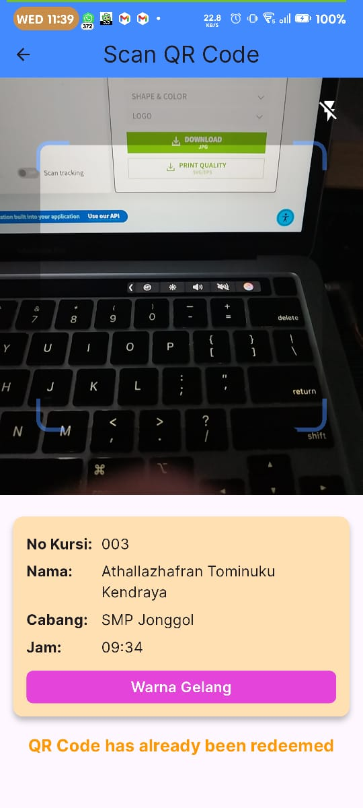
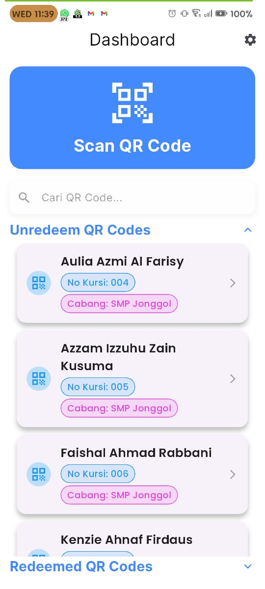
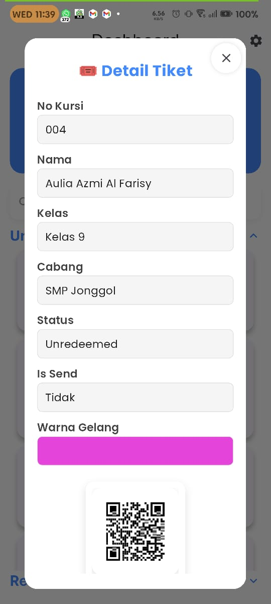
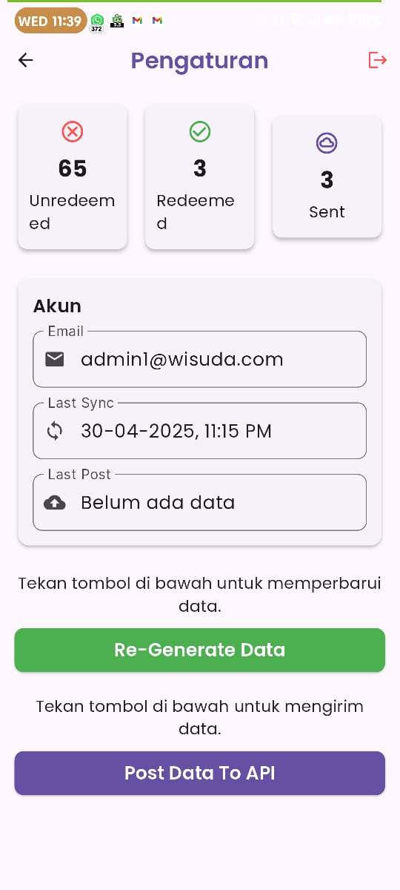

# 🎓✨ IDN Boarding School Graduation Ticket Scanner 🎫📱

## 🌟 Overview
The **IDN Boarding School Graduation Ticket Scanner** is a Flutter-based mobile application designed to streamline the ticket scanning process for graduation events. This application integrates with Google Spreadsheet API for data management and utilizes Hive for local storage. It is capable of functioning offline after a successful login and can synchronize data with the API once an internet connection is available.

## 🚀 Features
- 🔍 **Ticket Scanning**: Efficiently scan and validate graduation tickets.
- 📴 **Offline Mode**: Operates seamlessly without an internet connection after login.
- 📂 **Local Storage**: Uses Hive for secure and fast local data storage.
- 🔄 **Data Synchronization**: Automatically pushes data to the Google Spreadsheet API when a network connection is restored.
- 🔒 **User Authentication**: Ensures secure access to the application.

## 🛠️ Technology Stack
- 🖥️ **Flutter**: Cross-platform framework for building the application.
- ☁️ **Google Spreadsheet API**: For cloud-based data storage and management.
- 🐝 **Hive**: Lightweight and fast local database for offline functionality.

## 📋 How It Works
1. 🔑 **Login**: Users log in to the application to authenticate and download necessary data for offline use.
2. 🎥 **Ticket Scanning**: The app scans tickets using the device's camera and validates them against the local database.
3. 📴 **Offline Mode**: All scanned data is stored locally in Hive when offline.
4. 🔄 **Data Synchronization**: Once the device is online, the app automatically pushes the locally stored data to the Google Spreadsheet API.

## 🛠️ Installation
1. 📥 Clone the repository:
    ```bash
    git clone https://github.com/emRival/event-ticketing.git
    ```
2. 📂 Navigate to the project directory:
    ```bash
    cd event_ticketing
    ```
3. 📦 Install dependencies:
    ```bash
    flutter pub get
    ```
4. ▶️ Run the application:
    ```bash
    flutter run
    ```

## 📖 Usage
1. 🔑 Log in using your credentials.
2. 🎥 Start scanning tickets using the camera.
3. 📊 View scanned ticket data in the app.
4. 🌐 Ensure the device connects to the internet periodically to synchronize data with the Google Spreadsheet API.

## 📋 Requirements
- 🛠️ Flutter SDK
- 📱 Android/iOS device or emulator
- 🌐 Internet connection (for initial login and data synchronization)

## 🤝 Contributing
Contributions are welcome! Please fork the repository and submit a pull request with your changes.

## 📜 License
This project is licensed under the [MIT License](LICENSE).

## 📞 Contact
For any inquiries or support, please contact:
- 📸 **Instagram**: [@em_rival](https://instagram.com/em_rival)
- 🎥 **YouTube**: [@em_rival](https://youtube.com/@em_rival)

### Graduation Ticket Scanner Screens
|  |  |  |  |
| :------------------------------------------: | :--------------------------------------------: | :------------------------------------------------: | :--------------------------------------------: |
|          **📸 Scan QR Screen**               |          **📊 Dashboard Screen**              |          **🎟️ Detail Ticket Screen**             |          **⚙️ Settings Screen**              |
