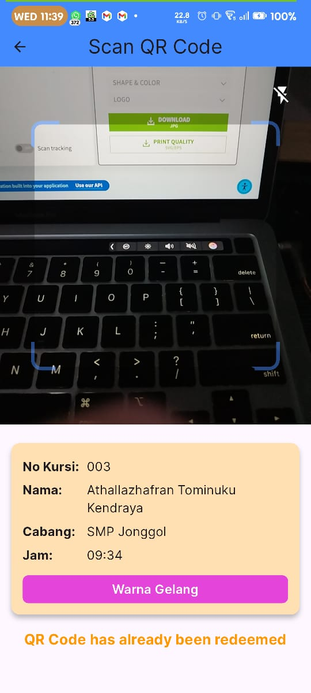
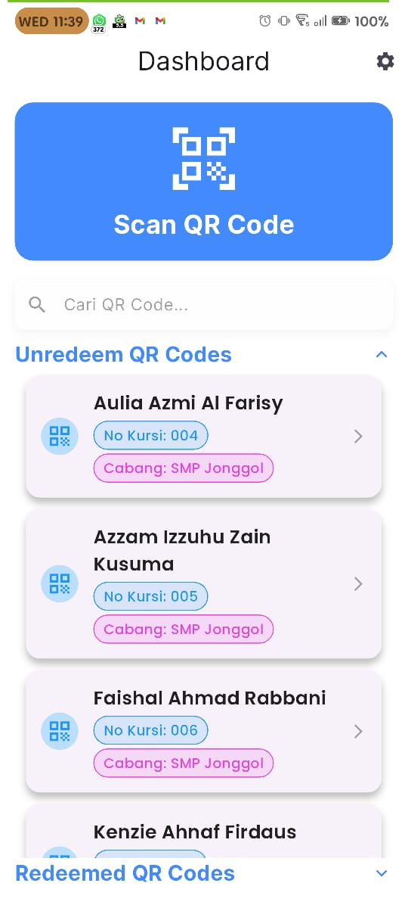
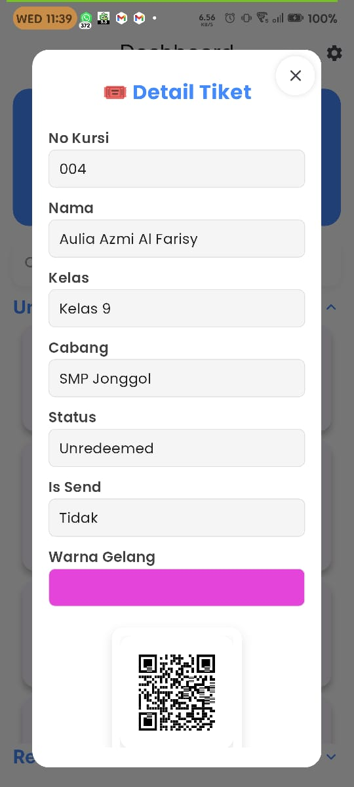
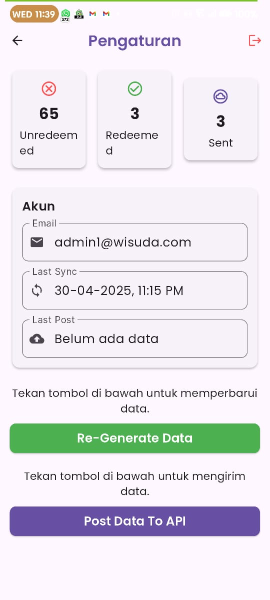

<div align="center">

# 🎓 IDN Ticket Scanner
**Professional Graduation Event Ticketing System**

[](https://flutter.dev/)
[](https://github.com/emRival/event-ticketing/releases)
[](https://opensource.org/licenses/MIT)

*A seamless, secure, and offline-capable ticket scanning application built for IDN Boarding School.*

<br>

### 📥 Download the App Now

[-3DDC84?style=for-the-badge&logo=android&logoColor=white)](https://github.com/emRival/event-ticketing/releases/latest/download/IDN-Ticket-Scanner.apk)
[-4CAF50?style=for-the-badge&logo=android&logoColor=white)](https://github.com/emRival/event-ticketing/releases/latest/download/IDN-Ticket-Scanner-Lite-v7a.apk)
[-000000?style=for-the-badge&logo=apple&logoColor=white)](https://github.com/emRival/event-ticketing/releases/latest/download/IDN-Ticket-Scanner-macOS.dmg)
<br>
[](https://emRival.github.io/event-ticketing/)

<br>

</div>

---

## 🌟 Overview
The **IDN Boarding School Graduation Ticket Scanner** is an advanced Flutter-based application designed to streamline the ticket scanning process for graduation events. It seamlessly integrates with the Google Spreadsheet API for data management and utilizes Hive for an ultra-fast local storage layer. 

The app shines in its **Offline Mode** capability—functioning perfectly without an internet connection after the initial login, and automatically synchronizing scanned data back to the cloud once network connectivity is restored.

---

## 🚀 Key Features
- 🔍 **High-Speed Ticket Scanning**: Effortlessly validating attendee QR Codes in milliseconds.
- 📴 **True Offline Mode**: Operates seamlessly in environments with zero internet access, perfect for crowded venues.
- 📂 **Robust Local Storage**: Powered by Hive for highly-encrypted and blistering-fast local data transactions.
- 🔄 **Auto-Synchronization**: Intelligently queues and pushes local data to the Google Spreadsheet API when a connection triggers.
- 🎨 **Responsive UI/UX**: Cross-platform Apple-quality design tailored perfectly for Mobile, Desktop, and Tablet formats.

---

## 🛠️ Technology Stack
- 🖥️ **Flutter**: Core cross-platform UI framework.
- ☁️ **Google Apps Script (Spreadsheet API)**: Cloud backend and persistent data layer.
- 🐝 **Hive**: Offline-first NoSQL database.
- ⚡ **Mobile Scanner**: Native high-performance Camera/QR engine.

---

## 📋 How It Works
1. 🔑 **Login**: Event organizers sign in with their unique credentials to securely pull down attendee metadata.
2. 🎥 **Scan**: Scan digital or physical tickets leveraging the optimized camera engine.
3. 📴 **Store**: Any validated scan is securely locked locally into Hive during offline scenarios.
4. 🔄 **Sync**: The app detects returning internet signals and syncs the validated attendance sheet back to the Cloud automatically.

---

## 💻 Installation & Usage

### 🍏 macOS Users
Because this app is not distributed through the Mac App Store, macOS Gatekeeper might block the initial launch. Follow these steps:
1. Double click the `.dmg` file to open it.
2. Drag the **IDN Ticket Scanner.app** into the **Applications** folder shortcut.
3. Open your Applications folder, **Right-Click** on `IDN Ticket Scanner.app` and choose **"Open"**. 
   *(If prompted by a security warning, click "Open" or go to System Settings > Privacy & Security > "Open Anyway").*

### 🤖 Android Users
Simply download the appropriate `.apk` file for your device architecture and install it. If prompted, allow "Install from Unknown Sources" in your Android settings.

---

## 💻 Developer Setup
Looking to build locally? Follow these steps:

1. Clone this repository:
```bash
git clone https://github.com/emRival/event-ticketing.git
cd event_ticketing
```

2. Resolve Flutter dependencies:
```bash
flutter pub get
```

3. Run the application (Android/iOS/macOS via connected device):
```bash
flutter run
```

> **Note**: To compile the exact Release architecture, use `flutter build apk --release --target-platform android-arm64` or `flutter build macos --release`.

---

## 📸 Screenshots

| <br>Scan QR Code<br><br> | <br>Dashboard Overview<br><br> | <br>Detail View<br><br> | <br>Settings<br><br> |
| :------------------------------------------: | :--------------------------------------------: | :------------------------------------------------: | :--------------------------------------------: |
|  |  |  |  |

---

## 🤝 Contributing
Contributions, issues, and feature requests are welcome!  
Feel free to check the [issues page](https://github.com/emRival/event-ticketing/issues). If you'd like to contribute, please fork the repository and use a feature branch.

## 📜 License
This project is [MIT](LICENSE) licensed.

---

<div align="center">
  <b>Built with ❤️ by Muhammad Rival</b><br><br>
  <a href="https://instagram.com/em_rival">Instagram</a> • 
  <a href="https://youtube.com/@em_rival">YouTube</a>
</div>
